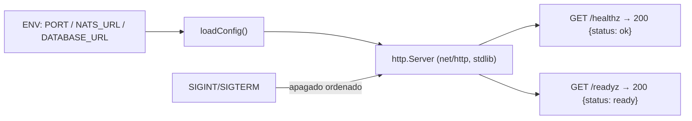

# onix-ingestor

Punto de entrada de la telemetría de OnixGuard. Escrito en **Go**.

> **Estado (Fase 1 ✅):** servicio **core** = ingestor + recorder combinados. Consume `onix.raw.*` de NATS/JetStream (consumidor durable `onix-core`) y **persiste en Postgres** auto-registrando `project`/`agent`/`session`. Mantiene `/healthz` y `/readyz`. Sin `DATABASE_URL` corre en modo health-only.
> Verificado E2E (2026-09-30): un evento real publicado por `onix-hook` queda en Postgres en <1s. Se dividirá en `onix-ingestor` + `onix-recorder` en Fase 2.

---

## Responsabilidad (destino)

| Fase | Qué hace este servicio |
|------|------------------------|
| **0 (ahora)** | Servicio core temporal: `/healthz` + `/readyz`. Fija el contrato de config (`PORT`, `NATS_URL`, `DATABASE_URL`). |
| **1** | Consume `onix.raw.*` de NATS y (combinado con recorder) persiste en Postgres → **lista de actividad en vivo**. |
| **2+** | Se separa: **solo valida y normaliza** (`raw` → `norm`). No persiste ni analiza. |

Flujo final: `NATS onix.raw.*` → **onix-ingestor** (valida/normaliza) → `NATS onix.norm.*`.

## Cómo funciona internamente (hoy)



- **Sin dependencias externas** todavía (solo la stdlib de Go): compila rápido y la imagen final es mínima.
- **Apagado ordenado** con `signal.NotifyContext` + `srv.Shutdown`.
- **Logs estructurados** en JSON con `log/slog`.
- **`-healthcheck`**: modo cliente que usa el `HEALTHCHECK` de Docker (hace GET a `/healthz` y sale 0/1). Necesario porque la imagen es *distroless* (sin shell ni curl).

## Estructura

```text
cmd/onix-ingestor/main.go        # servidor + config + healthcheck
cmd/onix-ingestor/main_test.go   # tests de los handlers
Dockerfile                       # multi-stage (golang → distroless)
go.mod                           # module github.com/levapo97-cell/onix-ingestor
```

## Correr

```bash
# Local (requiere Go 1.23+):
go run ./cmd/onix-ingestor           # escucha en :8081
curl localhost:8081/healthz          # {"status":"ok",...}
go test ./...

# Docker (no requiere Go en el host):
docker build -t onix-ingestor .
docker run -p 8081:8081 onix-ingestor
```

En el conjunto se levanta con `make dev` desde **onix-deploy** (junto a NATS y el frontend).

## Variables de entorno

| Var | Default | Uso |
|-----|---------|-----|
| `PORT` | `8081` | Puerto HTTP. |
| `NATS_URL` | `nats://nats:4222` | Bus de eventos (se usa desde Fase 1). |
| `DATABASE_URL` | — | Postgres externo (se usa desde Fase 1). |

---

*Parte de OnixGuard · Fase 0 (Cimientos). Ver el plan en `OnixGuard/docs/PLAN.md` §1 y §13.*
